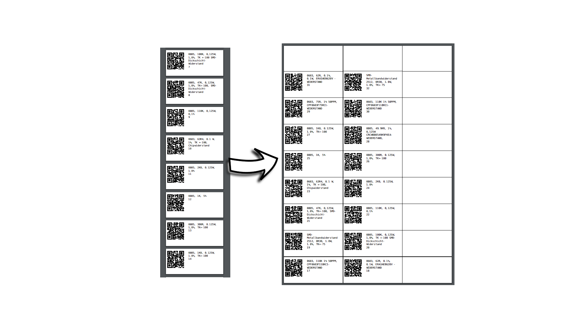

# PDF-Gridify
A simple python script that takes in a multipage pdf and puts the pages in a grid on a larger page then the original.

I made this script to help me with printing labels from [Part-DB-server](https://github.com/Part-DB/Part-DB-server).
Because when generating the labels from the server, it generates a pdf with one label per page with a 
page the size of the label.
But I wanted to print multiple labels on a single sheet of A4 paper.

During the process the pages aren't scaled or cropped.
Optionally a grid can be added to the output pdf, dividing the single pages.

## Example
